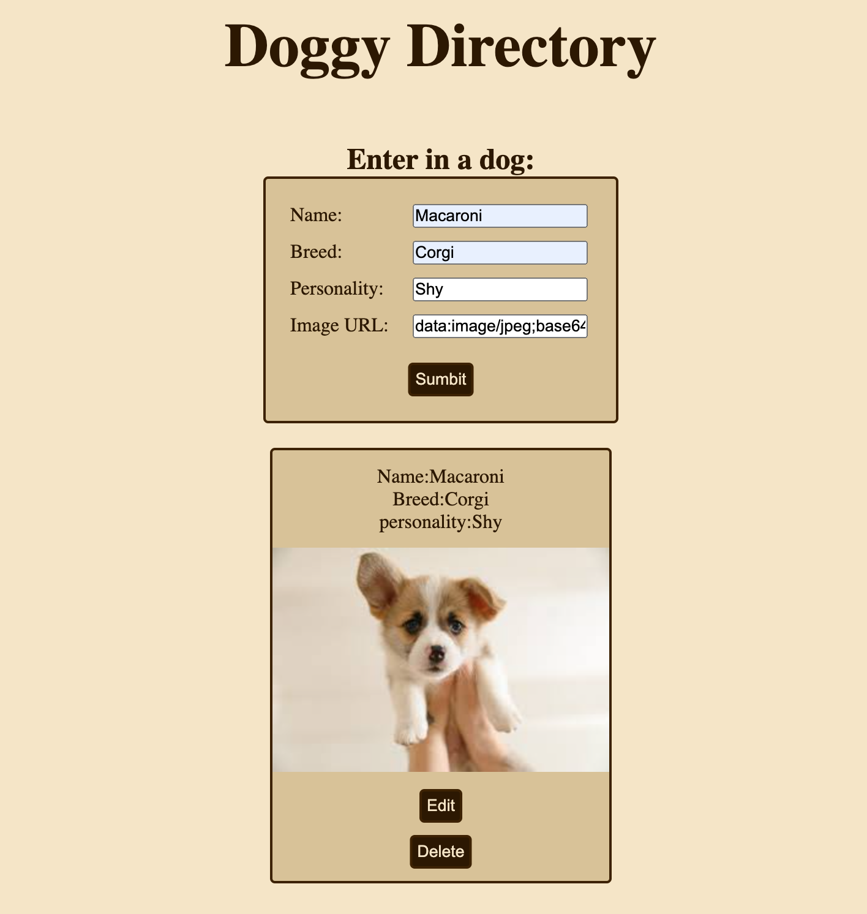

# Doggy Directory

## A directory used to store doggy data!

I created this project to better my understanding of react & express. This is the back end to the project. Here I focused on learning how express routing works, handing user requests to dynamic routes, and utilizing node's file system controls to perform CRUD operations on JSON data.

Check out more of my GitHub repositories [here](https://github.com/rileygcastle)
